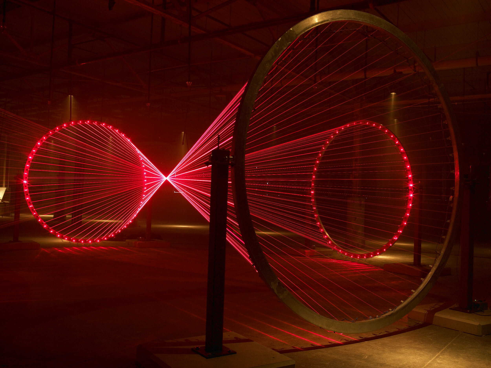

# Lasers and Laser Projectors

* Laser Projectors
* Laser Projectors and Video
* Laser Projectors and film techniques
* Laser Diodes and other approaches
* Lasers and photosensitive surfaces

## Laser Projectors 

[Laser projectors](https://en.wikipedia.org/wiki/Laser\_projector) have some really unique visual characteristics that make them ideal for the right content and application. Most of them work by shining a combination of different colored lasers (red, green and blue) onto a motorized mirror that moves incredibly fast. They have been around for a while, but due to several factors they aren’t used very regularly in art pieces and performances. Here is a thirty minute [video](https://www.youtube.com/watch?v=o1b5P\_3OkEc) from the International Laser Display Association ([ILDA](http://www.ilda.com)) showing a range of different visuals that can be achieved with lasers. They are are understandably confused with other [laser video projectors](https://en.wikipedia.org/wiki/Laser\_video\_display) that usually use a more [traditional display and lasers as a light source](http://pro.sony.com/bbsc/ssr/show-projectors/resource.solutions.bbsccms-assets-show-projectors-laserprojectorslandingpage.shtml).

The primary hindrance in working with lasers is that they are quite dangerous. While staring straight into a 10,000 lumen projector may feel uncomfortable, it is not nearly as likely to blind you. A laser light beam is so concentrated that it can cause serious damage by literally boiling the cells in your eyes until they burst and scar. Even a 1 milliwatt laser can cause permanent damage to your eyes if you stare at it, but 5mw and above is where your eye’s natural reflex to blink won’t even protect you — see more details on laser safety [here](https://en.wikipedia.org/wiki/Laser\_safety) and [here](http://www.laserpointersafety.com/FAQ/FAQ.html). Consumer laser pointers are comparably low powered and will be 1mw to 5mw. Laser projectors on the other hand are going to be 485mW, 1W, 2W or more. Brightness essentially correlates with wattage with these. High wattage beams can be fire hazards or burn the skin if used irresponsibly. It is recommended or required that you use specialized eye protection when working with these lasers because a stray reflection for only a few milliseconds can cause damage. Different states and countries have varying restrictions on the use of lasers in [live events](https://en.wikipedia.org/wiki/Laser\_lighting\_display) and most places require a licensed operator or a variance. The restrictions are typically on which direction the lasers shine, and how far above or away from the audience they should be shining. Some laser projector [vendors](http://x-laser.us) provide the necessary usage variance when purchasing them.

The danger factor is unfortunate because lasers have a very unique aesthetic. The sharpness of their beam gives them a vector quality that is almost impossible to represent with the pixel density available in today’s projectors and displays. The scanning motion of the mirror makes the drawn lines sort of infinitely continuous instead of being comprised of discrete elements. The [Vectrex](https://en.wikipedia.org/wiki/Vectrex) of the 1980’s had a similar aesthetic.

This mechanical method of drawing has its limitations in that the mirror can only move so fast and draw so much in a given “frame.” If a laser projector tries to draw an image that is too complex, the image can appear to flicker because it can’t actually draw all of the points needed in a single frame, so its “framerate” drops. This flicker effect is painfully obvious when laser projectors are filmed, which makes them an unlikely choice for something you plan to document. Most laser projectors have specifications on how many points per second (pps) they can draw — some of the low end ones can do 20,000pps or 20kpps, and higher end ones can do double that or more. 20,000 points sounds like a lot, but 20,000 per second means you only get something like 330 individual points _per frame_ if you’re trying to draw at 60fps. This means you have to be smart about your content and economical about where your image complexity is.

Additionally, since the laser doesn’t scan left to right, top to bottom like the electron beam in a CRT television, it means you can’t just order your points all over the place, send them to the projector, and expect it to work out. Ideally, the beam should move as little as possible to its next point so that the motor isn’t trying to draw one extreme side and then another — the time it takes to move the mirror that far can have a serious impact on its draw speed. This also means that you’ll really only ever see shape outlines on these kinds of projectors, because filling in a shape would take far too many mirror motions and your eye wouldn’t see it as continuous anymore. The motion of the mirror also limits the “throw ratio” of the projected image. The width of the projected image is typically much smaller than a lot of video projectors that you may be used to — this means you need to be much further back from a surface if you want a larger image. The good news is, compared to video projectors, you’re losing a lot less light when you increase the scale of your image. The specs on a laser projector don’t always clearly tell you the expected width, so you will have to put on your math goggles to figure out the size at a given distance.

The other thing to consider about laser projectors is their contrast and their color reproduction ability. Regular projectors still have issues with their black levels because they are still shining light even when the scene is black, and this lowers their overall dynamic range. Laser projectors don’t have this problem because they only project light where it needs to be, so their lines really pop. However, you’re less likely to have access to a laser projector that can cover a wide color gamut — some cheaper projectors will only give you about 7 colors by mixing red, green and blue lasers. High quality projectors can do a wider range of color mixing. Dimming the beam can also be tricky unless you are using a high quality projector with a good blanking control.

TUNDRA is a studio that has done several laser-based artworks. Their piece _The Day We Left Field_ uses several projectors to sweep across a hanging field of plans that results in a very volumetric feel.


TUNDRA - The Day We Left Field


### Laser Projectors with Video


Orbis by 1024 Architecture


Laser projectors have a very specific aesthetic because of their individual lines and lack of ability to fill in content. There are a few artists and projects that are exploring what happens when you combine either multiple laser projectors or a laser projector and a video projector together to create high contrast content. In the video projector + laser projector camp, you can get the crisp bright lines of lasers and the fill and dynamics of a full video image. To achieve this you need software or content that aligns the light of the two projectors, essentially mapping them together.


Lasermapping from Intus


There have been attempts at using laser projectors to create more "filled"/rasterized content as well. One project below from Alberto Novello uses 4 laser projectors and special software to essentially create a raster image and overcome the limitations of how much of an image a single projector can draw.


Alberto Novello's 4 Laser Raster Test


Other artists exploring the laser + video projector aesthetic:

* [Karl Skene](https://www.instagram.com/karlskene/)
* [1024Architecture](http://instagram.com/1024architecture)
* [aka\_chang](https://www.instagram.com/aka\_chang/)

### Laser Projector filming techniques

There are also some tricks that can be pulled off with laser projectors when combined with specialzied filming techniques. [Precision Lasers](https://www.precisionlasers.com) is a company that has pioneered and perfected this tecnique of synchronizing the animation of a laser with the shutter speed of a camera. The results of proper sync are beams of light that appear to be frozen in mid air. Their work for Childish Gambino for SNL is a classic example of the kinds of effects that are possible with this approach. The same visual does not come through to the naked eye in the same way due to the need for tight alignment, but it is still a fascinating application for filmed projects.


Precision Lasers with Childish Gambino on SNL.


### Laser Diodes and other uses of Lasers

Some projects don't use Laser Projectors but rather use individual laser diodes in different sculptural ways, such as in [Matthew Schrieber's Focal Point](https://www.matthewschreiber.com/laser-catalog/focal-point-series) shown above. While these fall more firmly in the "light art" part of the display spectrum, I feel they are worth mentioning because they often involve an animation element.

This approach requires a bit of custom work to identify the right diode and then create a way to control or position them them in just the right way. Laser Diodes also typically just stay in one color, hence the very red or green aesthetic shown in most examples. Diodes are a specialized lighting element and must be handled with care. Aside from the safety concerns of getting a diode that is too powerful, they also typically have some limitations on their "duty cycle" or how long they are designed to run continuously over a 24 hour period. If they run continuously for too long, they risk burning out or losing some of their overall power. Pieces must take this into account and have a way to power themselves down every few hours to make sure that their lifespan is preserved. Additionally, because of their nature of illumination, laser diode sculptures and display pieces often require the use of fog machines or hazers to fill the space with particles that allow people to see the beams themselves.

Other artists that work with lasers in this way are Shohei Fujimoto. Their piece Intangible Forms uses hundreds of individual diodes mounted on motorized elements that allow them to sweep and create shapes that float in the air (somewhat similar in spirit to [volumetric projection](../techniques/volumetric-projection.md)).


Shohei Fujimoto's Intangible Forms



TUNDRA's _Outlines_


See also:

* [https://rlfbckr.io/work/mirage/](https://rlfbckr.io/work/mirage/)

### Lasers and photosensitive surfaces

Its also worth mentioning that lasers projecting onto photosensitive surfaces (aka glow-in-the-dark paper) can be used for a specialized visualization technique.


Albert Novello's Laser Projection on photosensitive surfaces



Daito Manabe and Motoi Ishibashi's experiments


To add:

* Lasers and Projection mapping
* Pangolin Beam Brush [https://pangolin.com/blogs/news/beam-brush-paint-with-laser-light](https://pangolin.com/blogs/news/beam-brush-paint-with-laser-light)
