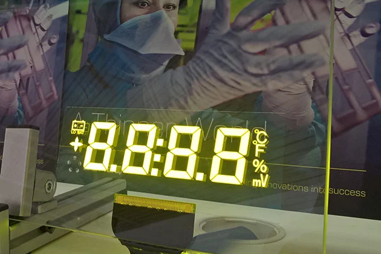

# Transparent

* Transparent LCD and OLED
* Transparent LED
* Spinning Fan Displays/Persistence of Vision
* Electroluminescent Displays

## Transparent LCD and OLED 


[https://vimeo.com/50200308?embedded=true\&source=video\_title\&owner=3549383](https://vimeo.com/50200308?embedded=true\&source=video\_title\&owner=3549383)


LCD’s are a transmissive technology (in contrast to Plasma or LED that are emissive technologies). This means that light passes through a medium to get to your eye. The backlight that is used for LCD’s is meant to provide a strong and very even field of light that gets passed through the actual liquid crystal/polarizer element. Essentially, the backlight is a flat light box that you can fade up or down, but it doesn’t have much else to do with creating the image itself.

A liquid crystal element can function perfectly fine on its own, without a proper backlight. This means that an LCD can effectually work as a transparent monitor if you are keeping some sort of light source between the screen and the viewer.&#x20;

A common usage is to put an object in a box with a strong, even light behind it, and have at least one side of the box be a transparent screen. This allows you to superimpose sharp graphics that appear to float overtop of the object inside. The [Hypebox](https://www.hypebox.io) is a commercial product that is built around this idea of a transparent screen that has a strongly backlit box behind it for placing different products. This can be combined with a standard touch screen for interactive transparencies. Also, since LCD’s do such a good job at blocking light, when they are displaying black they are nearly impossible to see through (when facing front on), providing a unique reveal effect. A bright point light source can be put behind them to use the LCD as a sort of projection mask — resulting in a variation on a normal projector (your projected image will probably be fuzzy without focusing lens elements though).



Some artists and studios have also been able to source custom LCD elements that are closer to the LCD’s that are used in old pocket calculators with only a few elements that can be turned on and off. Pieces that come to mind are [Hypersonic’s Patterned by Nature](http://www.creativeapplications.net/c/patterned-by-nature-transparent-pixels-in-the-north-carolina-museum-of-natural-sciences/) and [Iris by Hybe](http://www.creativeapplications.net/processing/iris-by-hybe-new-kind-of-monochrome-lcd/).

A challenge with transparent LCD’s is sourcing usable ones. There is a [DIY route](../appendix/diy-transparent-screens.md) — but the visual results aren’t great. Only a few commercial vendors supply these screens, and because it is a specialty item, they tend to be more expensive than comparable screens with backlights. You may also be limited by certain available sizes — making it difficult to scale these to a large application. Even if the screens were tiled together, at least one edge needs to have the driver board on it, so its not as easy to tile them together like normal LCD walls. The color reproduction with these transparent LCD's tends to be a little duller than the vibrant colors you’re used to. Their transparency can be cloudier compared to regular glass since the polarizer and liquid crystal layers are sandwiched in there as well. I’ve found that black, white and gray content is the most striking on transparent LCD’s.

### Transparent OLED


LG Transparent Display


Compared to transparent LCD, transparent OLED’s, however, are a different beast. OLED is an emissive technology and therefore does not require a backlight. This means that brightness and color reproduction will be much better compared to transparent LCD. Their brightness still isn’t going to rival a normal display, so they aren't ideal for any sort of outdoor use or in a brightly lit space. Also, in contrast to a transparent LCD that works somewhat equally on both the front and back, for now, transparent OLED is only visible on one side since the emissive element is designed to point in one direction.

Transparent OLED’s are still very useful for a lot of creative applications like being applied to a storefront window without blocking the view or applied onto a mirror so that graphics can be superimposed on top of the mirror. You can also position a camera directly behind them when doing magic mirror digital effects. You can stack multiple OLED’s in front of each other for a layered effect, but there is a caveat. There is a significant darkening effect that occurs when looking through the panels, it’s like a few stops of a neutral density filter — so when you stack them, they get darker and darker as you go backwards. There is also a larger display driver that comes off the back about 8 inches down the long side on the models I have seen, so this limits your ability to layer them closely together for a volumetric display.

Transparent OLED's used to be available for a short time in the mid 2010's and then kind of disappeared from the market for some time. Some of the rumored reasons for this are that the displays produced back then had some serious manufacturing issues that led to them being very expensive and difficult to produce. They also had a limited or unknown lifespan and it was difficult to rely on them for permanent installations. As of 2022, [LG](https://www.lg.com/us/business/oled-displays/lg-55EW5F-A) and [Planar](https://www.planar.com/products/transparent-oled-displays/) currently offer transparent OLED solutions that top out at 55" 1920x1080p displays. The cost of transparent OLED is still considerable since it is a niche product - some estimates are in the $20,000-$25,000 range for a single 55" display.

Also, be wary - while there may be other providers of transparent OLED, they are usually using Samsung or LG components. Some potential rental sources of some old transparent OLED I’ve come across are [ABComRents](https://www.abcomrents.com) and [Oxygen Eventworks](http://oxygeneventworks.com). These screens can also be made interactive with different touchscreen approaches.

### Transparent LED

There are a few different approaches to Transparent LEDs that are out there in the market.&#x20;

The most common and slightly cheaper solution are products that essentially have rows of LEDs on very thin metal strips that are mounted in large frames. There are resolution limitations with these solutions because of their consruction and the need for gaps to create the "transparent" effect, but they are great solutions for stage shows and architectural installations. [Roe's Vanish](https://www.roevisual.com/en/products/vanish-v18) line is an example of this type of a product.

The other transparent LED solution out there uses LEDs that have been mounted on special glass panels. These LEDs are powered and controlled using very thin, nearly invisible eletrical leads on the glass. There are limitations on the pixel pitch, brightness and resolution with these products, but they provide a fairly convincing transparent effect. Due to brightness and reoslution limitations, they are best used on large scale architectural installations and intended primarily for evening and nighttime viewing as opposed to full daylight.

[GLAAM's G-Glass](https://glaamamerica.com/products/) product is one example of a commercial product in this space:



### Spinning Fan Peristence of Vision Displays

There are a lot of products out there for these kinds of "holographic" spinning fan displays that could be considered a different type of "transparent" display. [Hypervsn](https://hypervsn.com) comes up the most often for a single and multiple unit system. These products use a spinning mechanism and a strip of LEDs on each fan blade. When the fan spins fast enough, the LED's draw each frame and the persistence of vision illusion allows a user to see an image that appears to float in mid air.&#x20;

By their nature, these displays are still just perceptually flat and not true 3D, but with the right content they can provide some convincing visual tricks. One nice element of these displays is that they are scalable in the sense that multiple units can be linked together to create larger images.



Artists such as [TUNDRA](https://wearetundra.org) have found other interesting applications of these technologies by layering them with different content, such as in their piece _Row_



There are also other ways to create the same persistence of vision effect using lateral motion. In the experiment video below, an engineer experimented with quickly vibrating a thin strip of "FlexLEDs" up and down to create a rough sketch of how this could work.



### Electroluminescent Displays

These are similar to old LCD displays for calculators in that they are somewhat fixed in the images they can display as they rely on illuminating special layers of material as opposed to individual pixels. One provider is [Lumineq](https://www.lumineq.com/products/in-glass-laminated-displays?hsa\_acc=4647806447\&hsa\_cam=6925704645\&hsa\_grp=82442195409\&hsa\_ad=475601411255\&hsa\_src=g\&hsa\_tgt=kwd-296865476399\&hsa\_kw=transparent+touch+screen\&hsa\_mt=b\&hsa\_net=adwords\&hsa\_ver=3\&gclid=CjwKCAjw682TBhATEiwA9crl34288mEN7vergmIph-bqKr2Xv\_k5UpD0tTC6gyVPWmQ3mVbWGXRjJhoCXbQQAvD\_BwE).


Lumineq Demo Video

