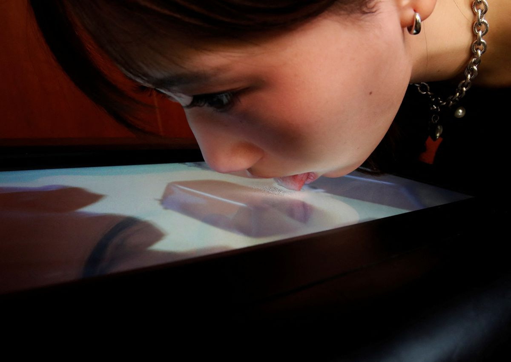

# Other Experiments

* Photosensitive
* Wedge Display
* Lickable Display
* Electrowetting Display

### Photosensitive Display

Harvey Moon of MBLabs created [Persistence](http://www.mblabs.org/projects#/persistence/), a piece that uses an array of ultraviolet LED's on a radial arm to draw things on a "glow in the dark" canvas. There is some similar work with Lasers on the [laser projector section](../displays/laser-projectors.md#lasers-and-photosensitive-surfaces).



### Wedge Display

The [CamFPD Wedge Display ](http://www.eng.cam.ac.uk/news/flat-screen-tv-masses-innovative-wedge-screen-offers-bigger-cheaper-displays)- No updates or news since 2004. Seems to be a similar principle to waveguide displays used for AR headsets by "projecting" light on a flat plane.

### Lickable Display

A [researcher](https://www.reuters.com/technology/lick-it-up-japan-professor-creates-tele-taste-tv-screen-2021-12-23/) has combined a traditional display with an aerosol dispenser to spray a screen with different flavors that can be licked by a user to be able to taste what is on screen. The project is called Taste the TV by researcher Homei Miyashita

### Liquavista Electrowetting Displays

These displays promised an alternative to E-Ink but with a faster refresh rate but never made it to market. [You can read more about them here](https://lookgadgets.com/liquavista/).

### Deconstructed LCD


[Cere Davis's Liquid Loom](https://www.ceredavis.com/liquid-loom)


