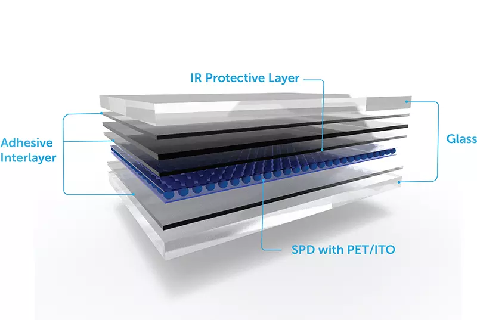
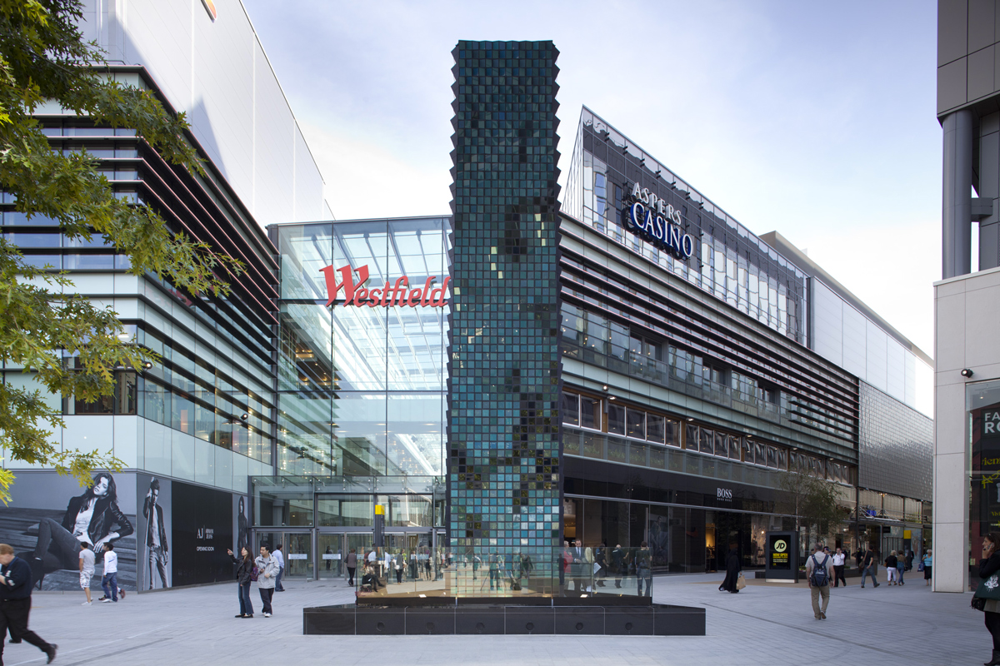

# Switchable Glass

Using switchable smartglass for creating low fidelity and low energy static displays.

There are a couple different approaches here:

* [PDLC](switchable-glass.md#pdlc)
* [SPD](switchable-glass.md#spd)
* [Electrochromic](switchable-glass.md#electrochromic)
* [LCD](switchable-glass.md#lcd)

### PDLC

PDLC is Polymer-dispersed liquid crystal. When an electrical current is applied, it basically goes from clear to diffuse and opaque. The reaction and change occurs very quickly and can be used to create unusual effects. It also uses a low amount of energy compared to traditional displays. When electrical current is not applied, the film is opaque, but when it is applied it becomes transparent. This effect is also "dimmable" in the sense that varying levels of current can ramp the opacity up or down.

Artist Simon Heijdens has one of the better known examples of using PDLC in  in their project [Shade](http://www.simonheijdens.com/indexbig.php?type=project\&name=Shade) that uses hundreds of triangles and nearly invislble electrical leads to create different visual effects with sunlight.


Simon Heijden's _Shade_


While there are a number of resources for PDLC Smart Glass in normal installations and configurations, they are mostly concerned with static applications on windows/conference rooms/etc. For specialized applications, like fragmented elements or larger architectural elements, you may need to collaborate with a company like [Gauzy](https://www.gauzy.com/products/).

### SPD

SPD stands for Suspended Particle Device.

SPD is similar to PDLC in mechanism, but more of an opacity/tint change than diffusion. It primarily stays in one color that is sort of a purple blue, so it has limited uses. It can transition fairly quickly but not as fast as PDLC or LCD.


Gauzy's SPD reference


SPD is a specialized product, but you can find it from vendors such as [Gauzy.](https://www.gauzy.com/spd-smart-glass/)

### Electrochromic Glass

This also operates under similar principles as the others. It is primarily a change in tint, as in SPD, but not in diffusion/opacity, as in PDLC. The clarity through the glass is largely untouched but it can cut a lot of the incoming light. The transition for this method works much more slowly, so it shouldn't be used for displays that require very fast image making. It is also just a transition between two colored states. One commercial use for Electrochromic glass is in airplane windows to replace shades

[Sage Glass](https://www.sageglass.com/en) is one manufacturer of Electrochromic Glass.

### LCD

LCD is a bit of a different class here and has been discussed briefly in the [transparent ](../displays/transparent.md)section, but it uses large LCD panels as individual pixels to turn different grayscale colors. The switching of the LCD opacity can happen rapidly just as in normal LCD monitors.\
\
It has been used for projects such as Sosolimited and Hypersonic's [Patterned by Nature](https://www.hypersonic.cc/art#/patterned-by-nature/)&#x20;


Patterned by Nature


Jason Bruge's studio also makes heavy use of specialized LCD panels, like in the piece [Digital Fountain](https://www.jasonbruges.com/digital-fountain/).

Finding a source for making custom LCD's in this way is a bit of a challenge since they are such a niche product. One source may be [Pacer](https://www.pacer-usa.com/displays/mono-lcd-displays/custom-lcd-lcm/). Another is [White Wing Logic](http://whitewing.co.uk) based in the UK who has created or advised on a number of the projects for Jason Bruge's studio.
