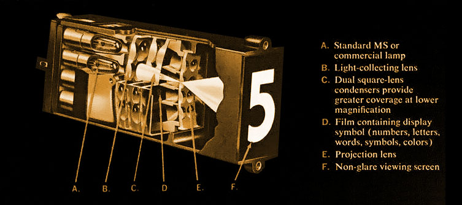

# Eggcrate and other Numeric Displays

* Eggcrate
* Nixie tubes
* Others

### Eggcrate



> An **eggcrate display** is one older method of displaying an alphanumeric character. It consists of a matrix of [incandescent light bulbs](https://en.wikipedia.org/wiki/Incandescent\_light\_bulb). A foam rubber mask with an array of holes surrounding the bulbs is attached to the display, causing it to resemble an egg crate.
>
> Some eggcrate displays use a complete 5×7 matrix for each digit, permitting the display of nearly all alphanumeric characters. Other types display only numeric characters and optionally a dollar sign. This type of eggcrate display is popularly used for sports [scoreboards](https://en.wikipedia.org/wiki/Scoreboard).
>
> Eggcrate displays have been used on many [game shows](https://en.wikipedia.org/wiki/Game\_show) to display contestants' scores and/or for countdown clocks because other types of displays, such as [LED](https://en.wikipedia.org/wiki/Light-emitting\_diode)[seven-segment displays](https://en.wikipedia.org/wiki/Seven-segment\_display), were prone to being washed out by bright studio lights. Though they continued to see extensive use well into the late 1990s, many shows began adopting LCDs in the 2000s. They have also been used as [variable-message signs](https://en.wikipedia.org/wiki/Variable-message\_sign) on highways, although they were later superseded by [flip-disc](https://en.wikipedia.org/wiki/Flip-disc\_display), fiber optic, and eventually [LED displays](https://en.wikipedia.org/wiki/LED\_display).

### Nixie Tubes

* [Link](https://en.wikipedia.org/wiki/Nixie\_tube)





### Others

* [Link to Friendlywire compendium](http://friendlywire.com/articles/displays/)
* [Industrial Alchemy midcentury numeric displays](https://www.industrialalchemy.org/tubepage.php?item=10\&user=0)
*   [One Plane Projector displays](https://www.industrialalchemy.org/articleview.php?item=511)

    <figure><figcaption></figcaption></figure>

