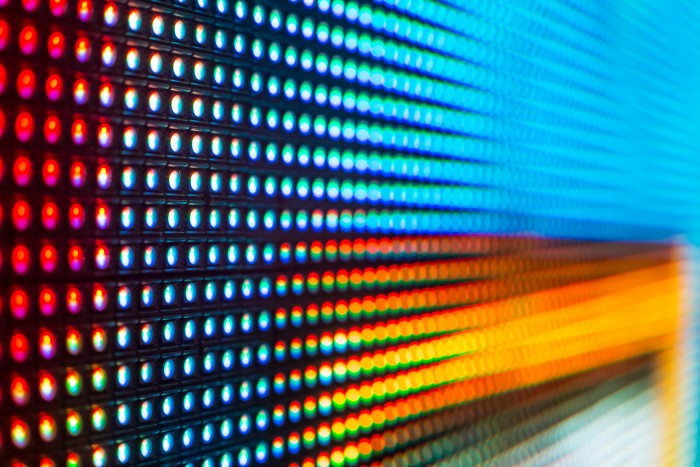

# LED

[LED Video Walls](http://pixelflexled.com/led-university/) are another common option for displaying digital art on a large scale (also called [LED Displays](https://en.wikipedia.org/wiki/LED\_display) — not to be confused with LED Monitors where the light source is simply the LED backlight). These are usually comprised of individual tiles that are linked together and driven by a special display driver box that addresses the tiles from a standard monitor input. The tiles are generally either single all-in-one RGB LED’s or larger individual R,G and B LED’s that are placed close together.&#x20;

The primary specification of an LED wall is its [pixel pitch](https://www.dgicommunications.com/what-is-pixel-pitch/), measured in millimeters. If you are viewing a wall close up, you want a low pixel pitch — some can get very small, even in the 0.9mm range and smaller these days. Larger pixel pitch such as 16mm to 20mm is perfectly acceptable if your viewer is really far away from the screen because their eye won’t be able to discern individual pixels as easily. LED displays are also one of the only display types that can be viewable in direct sunlight. Some of them are 3000nits or more of brightness, which explains why they are the display of choice in places like Times Square.

LED video walls have a wide variety of models and applications. Some are used as jumbotrons in stadiums, as high end storefront signage, or are used as sculptural stage elements. Some move towards the spectrum of lighting elements and are extremely high pixel pitch. These large pixel pitch tiles can be used almost as “transparent” elements because when the audience is far away, they are able to see through the frame — as in this [video wall](https://vimeo.com/143733724). Stage lighting examples are the [LightSlice](https://lmg.net/technology/lightslice/), [Vanish](https://lmg.net/technology/vanish-25-mm/), and the [Saber](http://www.upstaging.com/saber/). Some manufacturers also provide custom LED tile work and can do more unusual shapes like spheres, curves, triangles and more.

The primary drawback of LED walls is cost, although the prices have been dropping rapidly in the past few years as these become more commonplace. Most LED walls for events are typically rentals due to the large cost of purchasing and the labor to install them. They do last a long time in the case of purchasing, but even a modest sized wall at a high resolution can run into the hundreds of thousands of dollars very quickly. The cost of installation (for rental or permanent) can also be an additional hurdle since you typically need an experienced technician to set them up and get the pixel mapping established. Some stage designers will overlay a black or dark grey rear projection material or even acrylic overtop of the LED’s to soften them and provide a more diffuse look. When using an LED video wall for applications that require very close viewing distances, content design should be considered very carefully. LED walls can be so bright that using content on a white background in an indoor setting can feel a bit like staring at the sun - most walls used indoors are typically set at only a fraction of their potential brightness.

Because of some of the cost and special considerations involved in installation, most people will often work with an AV integrator to fascilitate the acquisition of the electronics needed for the LED wall, the media systems planning, the physical installation plan, and the installation itself. There are many options for integrators and different levels of involvement, but to name a few sources of LED product and integration options in the US, you can look at companies like Fuse Technical Group, DetaiLED Solutions, Creative Technology Group, Electrosonic, and Diversified to name a few. Some places are more suited for permanent installation versus rental and you often need to find the right fit for your project.
