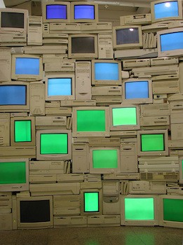

# Standard Displays Overview

Before we talk about "alternative displays" we should briefly cover what could be considered more standard displays. The main 3 categories are things like standard TV's and monitors (that have many subsets within them), LED video walls, and projectors.

### Standard Monitors

These can be a range of different technologies like LCD, OLED, and many others. Currently, the most common display is the Liquid Crystal Display or [LCD](https://en.wikipedia.org/wiki/Liquid-crystal\_display) and it is in most laptop screens, desktop monitors, commercial TV’s and so on. LCD’s have a backlight, a rear polarizer, a glass layer with electrodes and liquid crystals that react to electrical changes, and a front polarizer. Each pixel has a set of 3 sub pixels with red green and blue color filters that can be combined at different levels to recreate their millions of colors.

Technologies like [Quantum Dots](https://en.wikipedia.org/wiki/Quantum\_dot%23Light\_emitting\_devices) (such as in Samsung QLED line) promise to improve LCD’s color reproduction and accuracy by allowing more precise tuning of light wavelengths. [Plasma displays](https://en.wikipedia.org/wiki/Plasma\_display) were contender for LCD for a while, but they have become less popular. Pixels in plasma displays are individually lit which result in a deeper contrast compared to LCD’s.&#x20;

Organic Light Emitting Diode displays or [OLED](https://en.wikipedia.org/wiki/OLED) displays operate in a similar principal to Plasma and are now almost as common in consumer TV options as LCD displays. OLED has a lot of interesting properties since it can be made smaller and thinner than LCD or Plasma, this means that flexible displays and transparent displays are a much more viable option with OLED. OLED is still quite expensive in comparison to LCD’s at the moment, but this will change as the market shifts. [MicroLED](https://en.wikipedia.org/wiki/MicroLED) is another technology that works in a similar fashion but is still fairly new.

Standard monitors are affordable for most applications, are high resolution which makes them ideal for applications when the view is standing up close, have a decent color and dynamic contrast range, accept a variety of inputs, and are long lasting. Consumer displays are also typically two dimensional and flat, even if displaying 3D content with glasses or another method. Their brightness is suitable for primarily indoor applications. Brightness of these is generally measured in [nits or candela/sq meter](https://en.wikipedia.org/wiki/Candela\_per\_square\_metre) — most laptop screens are around 300nits at maximum. For outdoor applications, you have to source specially made outdoor monitors that are weatherproof, can withstand a variety of temperature fluctuation, and have a considerably higher brightness rating — some available ones can do 1500 nits or more which would be almost painful to look at up close in an indoor setting.

Of course, these displays have their limitations. They are only viable up to a certain size for a single unit. Most of the largest max out at 120in or 305cm of diagonal image. Past this, they must be tiled together to form a larger video wall, and there are inevitable lines or bezels between adjacent units. Even those larger video walls start to reach a limitation at a certain point where Projectors or LED video walls are a more economical choice.&#x20;

The color and dynamic range of these monitors appears to be decent, but it is [actually not as good as you might expect](http://www.newyorker.com/tech/elements/the-search-for-our-missing-colors)— we are missing out on a whole range of visible colors. Most standard displays are also locked at 60hz refresh rate (the speed that the screen is redrawn every second) which is perfectly fine for most applications like movie watching, but things like gaming monitors have started jumping to 240hz or more. Even though our brain’s visual refresh rate is about 60hz (a huge oversimplification), there are some intriguing things that can be done with a [higher refresh rate](../experimental-other/high-refresh-rate-displays.md). Imagine scrolling this page up and down and having it look as natural as a piece of paper moving up and down instead of the commonly jittery experience. There are also researchers looking into using high frame rate or high temporal resolution displays to do things like turning normal displays into higher resolution displays — here is an incredible [survey](http://people.csail.mit.edu/pdidyk/papers/ComputationalDisplaysSurvey.pdf) of a range of options with computationally augmented displays.&#x20;

LCD's Explained



OLED's explained:


