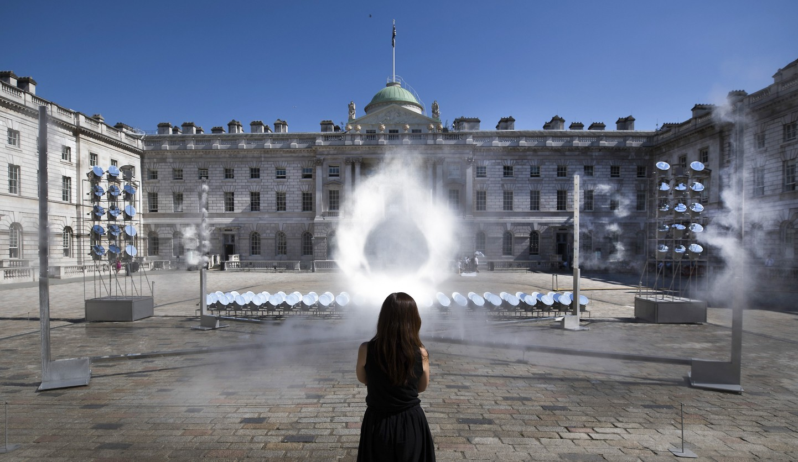
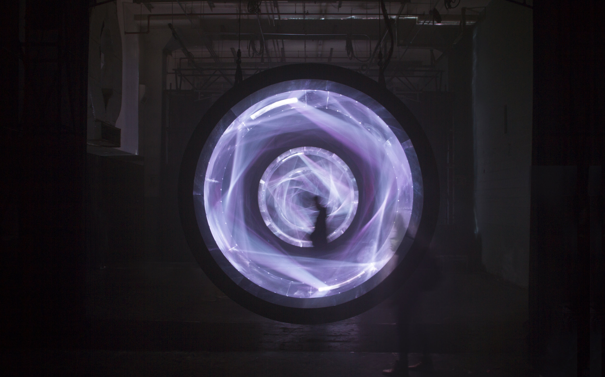

# Volumetric Projection

## Volumetric Projection 



Volumetric projection is a technique that is a much more technical application of projecting into a thin sheet of fog. Instead of having light come from a single point, it uses multiple light sources or specialized optics. By combining these sources with the additive quality of projected light, this technique is able to create dimensional images with multiple viewing angles. There are a few scientific papers out there on similar [processes](http://mrl.nyu.edu/\~perlin/holodust/), and we’ll discuss laser plasma displays later on that share some characteristics.

[Light Barrier](http://www.kimchiandchips.com/#lightbarriersecondedition) by Kimchi and Chips is likely the first piece to use this technique. With _Light Barrier_, the artists project images onto an array of parabolic mirrors. Using custom software that analyzes where the pixel’s light ends up after hitting the curved mirrors, they can approximate the path of light from each projected pixel. When this is done for the entire array of mirrors, they can calculate where in 3D space each pixel path intersects another after hitting the mirrors. The projection area above the mirrors is filled with haze from a fog machine — the medium for these intersecting light beams. If more beams illuminate a particular location in 3D space, then that spot will appear brighter. By hitting several of these overlapping spots together, the combined focal point becomes brighter, and images can be formed in the haze. There are other ways to achieve similar variations on the effect that involve multiple projector sources, but this gets logistically complex and expensive very quickly.

This technique currently has its limitations. Making recognizable images requires a calculation engine and custom software, meaning you can’t just drop in any content and have it show up in 3D. The workflows for generating content based on depth maps are improving, but there is also going to be an upper limit to how fine the details can be. It may take several dozen converging pixels to make a recognizable voxel — so once we have higher resolution projectors we might be able to put together even more complex visuals. Full color projection with this technique is also a challenge because the overlapping colors add together and change the colors for different viewing angles. White is also going to show up the best for an effect that is already going to be slightly faint compared to other projection methods. Nonetheless, it is an exciting area of discovery and still has a lot of potential to explore.

Kimchi and Chips have expanded on this idea with other projects. [_Another Moon_ ](https://www.kimchiandchips.com/works/anothermoon/)uses an array of high powered laser projectors (powered from solar energy collected during the day) to create a large scale floating sphere in the sky at night.

Realted to the above, in Halo they have also explored the idea of using specialized mirror arrays to focus sunlight into a cloud of fog to generate a floating sphere.

There are also variations on this idea that don’t involve fog or specialized optics. A simple way is to use layers of fabric — the image will be the same on each layer but will get larger or smaller on each pass. There is also the method employed by the [Lumarca](https://www.albert-hwang.com/lumarca) where a grid of thin strings are stretched to make a large volume. Each string in the volume can then be precisely mapped by a few columns of pixels from the projector. When the location of each column is then mapped to a known 3D space, it becomes easy to render simple graphics on the array of strings that appear to have volume. The strings transmit the light a bit, so it is easy to see from all sides. This method also has some density and fidelity limitations but is also easy to scale.



There are also abstract applications of projection that could be considered volumetric, like [Liminal Scope II](https://www.chrislunney.com/liminal-scope-ii) by the studio Hovver. This uses a pair of projectors in a fabricated circular structure filled with fog and mirrors. This approach allows them to create a sort of volumetric circular volume of light in an enclosed space.


Liminal Scope II by Hovver

