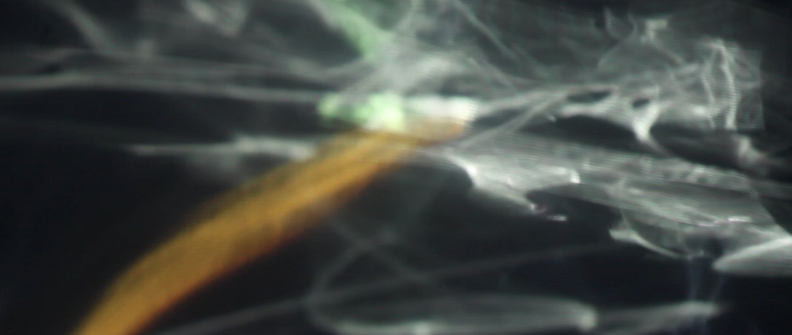

# 2022 Update Notes



(Original version from [Blair Neal](https://www.ablairneal.com))

This article was originally [created and hosted on Medium](https://laserpilot.medium.com/survey-of-alternative-displays-82d928480b9d), but its length on a single page made it very unweildy to keep it updated with fresh content. Additionally, most of the information is from the original writeup from 2015 and needs a pretty serious update as many things have changed in 7 years.&#x20;

This update will be ongoing and some sections may be more updated than others. Gitbook may not be the final resting place but it seems like the best approach for now.

🌟If you're on Github: This page is auto generated by Gitbook and is more readable [at the link here](https://blair-neal.gitbook.io/survey-of-alternative-displays/), especially for things like embedded videos.

If you're on Gitbook, the link to the [Github for this article is here](https://github.com/laserpilot/Survey\_of\_Alternative\_Displays). Please contribute if you'd like!

If your project or image is featured here and you would prefer me to remove it, please send me a message/email/etc (contact info on [my website](https://www.ablairneal.com)). Additionally, if you have something you think needs to change or be added, please submit a pull request and I'll add it in.

**Additions for 2022 compared to the original 2015 version:**

* Moved to github/gitbook
* Re-organized content and added a new outline
* Added new content and examples to almost every content page
* Added separate sections for Legacy, Technique, and Experimental approaches
* Added the following sections compared to the original, and dozens of new examples and videos. Most of the original categories also have many new subcategories within that weren't originally included.
  * Switchable Glass
  * Drone Displays
  * Many new Transparent displays and transparent OLED updates
  * Electrochromic Paint
  * Scanning Fiber Optics
  * Lasers and video projection
  * Laser Diodes
  * Many new Lightfield displays (Looking Glass, Solidlight, Fovi, Leia)
  * Architectural E-Ink
  * Ferrofluid
  * Acoustic Levitation
  * High Refresh Rate Displays
  * Cathode Ray Tube
  * Eggcrate and numerical displays
  * Pyrotechnics and other curiosities
  * Misleading terms
  * Touchscreen notes
  * XR and Virtual Production
  * ...and more?

This is currently using Gitbook's free plan. If there is enough interest, I could set up a tipjar or something for this project and open it up as a paid project with multiple contributors and the ability to export the entire thing as a formatted PDF.

###

### Notes on Contributing Updates

Content contributions are encouraged and welcomed! Please submit a pull request and I'll get back to you.

#### Categorizing:

While there are a ton of top level categories and a bit of inconsitency in how I'm organizing, I'm going to do my best to keep things in certain places. If you have a display technology that only has a single example, it will most likely be a better for the "Experimental" category instead of just the alternative display category.

In my (rough)categorization:&#x20;

* Alternative Displays: mostly commercial products and things you can buy or rent right now
* Techniques: a combination of a commercial product and a fabrication/optical technique
* Experimental/Other: this is a catchall for one-off art projects and lab/research experiments. Not a clear line between this and the technique section - open to suggestions on clearer delineations.
* Legacy: mostly for things that are discontinued or no longer used

#### Images:

I'd like to reduce the reliance on external images hosted that could eventually disappear. Please include images in the repo - just make sure they aren't overly large (<10-5mb please, aim for a compressed jpg if possible)

Gitbook works a little differently with images and they are stored in the .gitbook asset directory and have relative paths. See this example from the page in `/Alternative Displays/Lasers and Laser Projectors.md`

```

```

#### Content Embeds:

One important note is for embedding content, Gitbook uses a custom format for embeds - html/iframe would also be fine, but for consistency I've mostly stuck with Gitbook's formatting which looks like this:

```

 [https://www.youtube.com/watch?v=WxgVYCxShvA](https://www.youtube.com/watch?v=WxgVYCxShvA)

```

Note the odd spelling of "endembed" instead of embedded when adding a comment beneath an embed. Ideally adding a comment for what the video is will be hugely helpful later whenever youtube videos aren't visible.

```

 [https://www.youtube.com/watch?v=D1pa3UX89GA](https://www.youtube.com/watch?v=D1pa3UX89GA) Rollable OLED 

```

